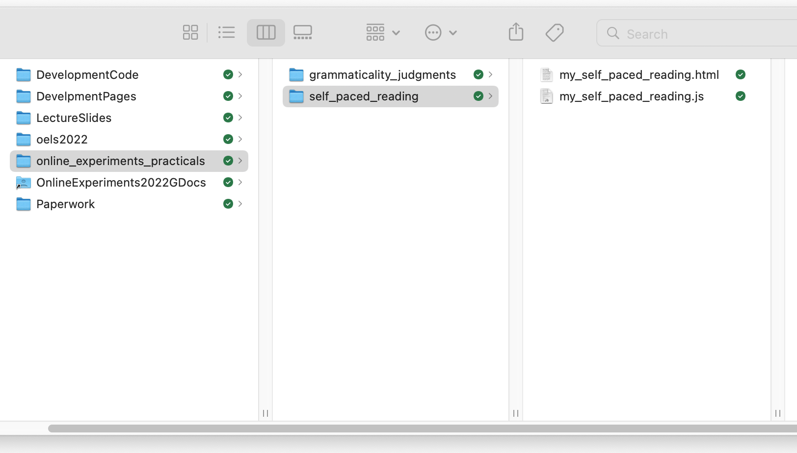

## The plan for week 5 practical

This week we are going to look at code for a simple self-paced reading experiment - as you should know from the reading this week, in a self-paced reading experiment your participants read sentences word by word, and you are interested in where they are slowed down (which might indicate processing difficulties). We therefore care about reaction times (which we didn't care about for our grammaticality judgments task last week, although jsPsych collected them for us anyway). We are also going to see some slightly more complex timelines, with trials that consist of several parts. Finally, I'll add an example at the end of how to collect demographic info from your participants, which is often something you want to do - here we'll focus on a very basic text survey and point you to more flexible options.

Remember, the idea is that you can work through these practicals in the lab classes and, if necessary, in your own time (e.g. if you want to make a start before the lab class, or if you don't complete the practical in the lab class) - the lab class provides dedicated time each week to focus on doing the practicals with on-tap support from the teaching team, but you may need more than the 2 hours to get these practicals done. We are happy to help with the previous week's class if you tried to finish it off in your own time and need some help.

## First: you build it!

Believe it or not, you already have the tools to build a simple self-paced reading experiment, so this week, rather than starting with us explaining how we'd do it, we want you to have a go yourself - try that, ask us for help if necessary, then after 30-40 minutes we'll bring everyone together, see how you got on, and move on to the rest of the practical.

To help you get started, we are going to provide you with a couple of templates to fill in - an html file that loads some of the plugins you will need (but once you decide what additional plugins you need you will have to figure out how to load them too), then a javascript file where you can put your own code. That javascript file includes some extra stuff (instructions and a demographics questionnaire) that we pre-built for you so you can focus on the self-paced reading part of the experiment. Don't worry about how the demographics questionnaire works for now, that is explained when we work through our complete version of the code.

You can download the starter templates through the following two links:

- <a href="code/self_paced_reading/my_self_paced_reading.html" download> Download my_self_paced_reading.html</a>
- <a href="code/self_paced_reading/my_self_paced_reading.js" download> Download my_self_paced_reading.js</a>

Note we are calling those files "my\_..." to distinguish them from the full code we'll give you later.

These two files should sit in a folder called something like `self_paced_reading`, alongside your `grammaticality_judgments` folder from last week - so your folder will now look something like this.



This code should run on your local computer (just open the `my_self_paced_reading.html` file in your browser) or you can upload the whole `self_paced_reading` folder to the public_html folder on the jspsychlearning server and play with it there (if your directory structure on the server is the same as suggested above, the url for your experiment will be http://jspsychlearning.ppls.ed.ac.uk/~UUN/online_experiments_practicals/self_paced_reading/my_self_paced_reading.html). **We strongly encourage you to at least check you can upload the code to the server and figure out the URL, since you will need to know how to do this for the final assignment.**

If you want to see what your finished experiment should look like, [you can run my copy on jspsychlearning](https://jspsychlearning.ppls.ed.ac.uk/~ksmith7/online_experiments_practicals/self_paced_reading/self_paced_reading.html).

If you run through the experiment you'll see that, in addition to the instructions and a demographics questionnaire at the end (which you don't need to code up - we have provided these in the `my_self_paced_reading.js` template for you), the experiment consists of the word-by-word presentation of two sentences ("Which events was the reporter describing with great haste?" and "Which building were the architects featuring in the portfolio?"), each followed by a yes/no question ("Did the reporter describe the events slowly?", "Did the architects have a portfolio?") - the comprehension questions are there to prevent participants just blasting through the sentence without actually reading it.

In a little more detail:

- for the word-by-word reading, the participant sees some text on screen and progresses to the next word by providing a keyboard response (the space key)
- for the yes/no questions the participant sees some text on-screen and provides a keyboard response (either the y or n key).

The yes/no questions in particular should remind you strongly of what we did last week, so you might want to start by implementing those (e.g. by copying, pasting and then editing code from last week) and then figuring out how to make further tweaks to get the word-by-word sentence presentation. Give it a go, see how you get on, and ask for help if/when you get stuck!

## Our implementation of a self-paced reading experiment

As you hopefully figured out when you were trying to build it yourself, the main part of the experiment uses a plugin you are already familiar with (`html-keyboard-response`), so the main new content this week will be showing you how to use a nested timeline to make the process of constructing multi-part trials a little smoother.

### Getting started

You need two files for our implementation of this experiment, which you can download through the following two links:

- <a href="code/self_paced_reading/self_paced_reading.html" download> Download self_paced_reading.html</a>
- <a href="code/self_paced_reading/self_paced_reading.js" download> Download self_paced_reading.js</a>

Again, stick these in your `self_paced_reading` folder, alongside the files for your implementation, on your computer and/or on the jspsychlearning server.

First, get the code and run through it so you can check it runs, and you can see what it does.

### Nested timelines

We'll walk you through our implementation. We'll start with a simple implementation that might be close to where you ended up when you built this experiment yourself, then we'll use some tricks to streamline this.

As you may have figured out already, each individual 'trial' in a self-paced reading experiment is actually rather complex: it involves word-by-word presentation of a sentence, followed by a comprehension question.

The way to do this in jsPsych is to have multiple trials per sentence: one trial for each word presentation, and then a final trial for the comprehension question. These are all `type: jsPsychHtmlKeyboardResponse` - for the word-by-word presentation we just want the participant to hit spacebar to progress, then we will make the comprehension question a yes/no answer (basically just like in the grammaticality judgments code from last week).

We _could_ just specify a whole bunch of trials like this:

```js
var spr_trial_the_basic_way_1 = {
  type: jsPsychHtmlKeyboardResponse,
  stimulus: "Which",
  choices: [" "],
};
var spr_trial_the_basic_way_2 = {
  type: jsPsychHtmlKeyboardResponse,
  stimulus: "events",
  choices: [" "],
};
var spr_trial_the_basic_way_3 = {
  type: jsPsychHtmlKeyboardResponse,
  stimulus: "was",
  choices: [" "],
};
var spr_trial_the_basic_way_4 = {
  type: jsPsychHtmlKeyboardResponse,
  stimulus: "the",
  choices: [" "],
};
var spr_trial_the_basic_way_5 = {
  type: jsPsychHtmlKeyboardResponse,
  stimulus: "reporter",
  choices: [" "],
};
var spr_trial_the_basic_way_6 = {
  type: jsPsychHtmlKeyboardResponse,
  stimulus: "describing",
  choices: [" "],
};
var spr_trial_the_basic_way_7 = {
  type: jsPsychHtmlKeyboardResponse,
  stimulus: "with",
  choices: [" "],
};
var spr_trial_the_basic_way_8 = {
  type: jsPsychHtmlKeyboardResponse,
  stimulus: "great",
  choices: [" "],
};
var spr_trial_the_basic_way_9 = {
  type: jsPsychHtmlKeyboardResponse,
  stimulus: "haste?",
  choices: [" "],
};
var spr_trial_the_basic_way_10 = {
  type: jsPsychHtmlKeyboardResponse,
  stimulus: "Did the reporter describe the events slowly?",
  prompt: "<p><em>Answer y for yes, n for no</em></p>",
  choices: ["y", "n"],
};
```

If we add those 10 trials into our experiment timeline (in the correct order!) that will present the sentence "Which events was the reporter describing with great haste?" one word at a time, waiting for a spacebar response after each word, then present a y/n comprehension question at the end. This is perfectly OK and will present the sentences as intended. However, it is quite unwieldy - there is lots of redundant information (we have to specify every time the trial type, the spacebar input), building the trial list for a long experiment with hundreds of sentences is going to be very error prone, and it would be impossible to randomise the order without messing everything up horribly!

Thankfully jsPsych provides a nice way around this. A slightly more sophisticated solution involves using nested timelines (explained under _Nested timelines_ in [the relevant part of the jsPsych documentation](https://www.jspsych.org/v8/overview/timeline/#nested-timelines): we create a trial which has its own timeline, and then that timeline is expanded into a series of trials, one trial per item in the timeline; any parameters defined at the top level are shared by all trials in the nested timeline, but you can override them if you need to. We can use nested timelines to form a more compressed representation of the long trial sequence above and get rid of some of the redundancy.

Here's a simple way to do this: we specify `type` at the top level, then for each trial in the timeline we specify the `stimulus`, the `choices` (which key press we will accept for this trial), and for the comprehension trial we also specify the `prompt` (the word-by-word trials don't need a prompt).

```js
var spr_trial_with_redundant_nested_timeline = {
  type: jsPsychHtmlKeyboardResponse,
  timeline: [
    //first 9 trials in the nested timeline: word presentation
    { stimulus: "Which", choices: [" "] },
    { stimulus: "events", choices: [" "] },
    { stimulus: "was", choices: [" "] },
    { stimulus: "the", choices: [" "] },
    { stimulus: "reporter", choices: [" "] },
    { stimulus: "describing", choices: [" "] },
    { stimulus: "with", choices: [" "] },
    { stimulus: "great", choices: [" "] },
    { stimulus: "haste?", choices: [" "] },
    //final trial in the nested timeline: comprehension question, which also has a prompt
    {
      stimulus: "Did the reporter see what happened?",
      prompt: "<p><em>Answer y or n</em></p>",
      choices: ["y", "n"],
    },
  ],
};
```

I like that what is conceptually a single trial - a sentence plus its comprehension question - is now a single (quite complex!) trial in the experiment, with a nested timeline, and I find that code quite clear to look at too. But you'll notice that there's still some redundancy - we have to specify the `choices` for the reading sub-trials 9 times. We can actually compress this a little further by exploiting the fact that we can _override_ the default `choices` for the comprehension question - we specify a default `choices` and then override it only when we need to, like this:

```js
var spr_trial_with_nested_timeline = {
  type: jsPsychHtmlKeyboardResponse,
  choices: [" "], //specify the default response
  timeline: [
    //first 9 trials use the default choices parameter
    { stimulus: "Which" },
    { stimulus: "events" },
    { stimulus: "was" },
    { stimulus: "the" },
    { stimulus: "reporter" },
    { stimulus: "describing" },
    { stimulus: "with" },
    { stimulus: "great" },
    { stimulus: "haste?" },
    //final trial in the nested timeline: comprehension question, which has a prompt and overrides the choices parameter
    {
      stimulus: "Did the reporter see what happened?",
      prompt: "<p><em>Answer y or n</em></p>",
      choices: ["y", "n"], //this overrides the default choices parameter
    },
  ],
};
```

So that's a single `html-keyboard-response` trial which has a default `type` and `choices` and a nested timeline; the first 9 items in the nested timeline are the spacebar-response trials, where we just have to specify the `stimulus`, and then the final item in the timeline is a comprehension trial with different `stimulus`, `choices`, and also a `prompt`.

**It's important to emphasise that these three ways of representing a self-paced reading trial all work**, and look the same from the participant perspective - which one you choose might be decided by things like what you plan to do for randomisation, or how confident you are that you understand what the nested trial lists are doing!

Nested trial lists therefore make it quite easy to build a single self-paced reading trial. However, it's still going to be a bit laborious to build a sequence of such trials. If you look in the code you will see that in order build two trials we do this:

```js
var spr_trial_1 = {
  type: jsPsychHtmlKeyboardResponse,
  choices: [" "],
  timeline: [
    { stimulus: "Which" },
    { stimulus: "events" },
    { stimulus: "was" },
    { stimulus: "the" },
    { stimulus: "reporter" },
    { stimulus: "describing" },
    { stimulus: "with" },
    { stimulus: "great" },
    { stimulus: "haste?" },
    {
      stimulus: "Did the reporter see what happened?",
      prompt: "<p><em>Answer y or n</em></p>",
      choices: ["y", "n"],
    },
  ],
};

var spr_trial_2 = {
  type: jsPsychHtmlKeyboardResponse,
  choices: [" "],
  timeline: [
    { stimulus: "Which" },
    { stimulus: "building" },
    { stimulus: "were" },
    { stimulus: "the" },
    { stimulus: "architects" },
    { stimulus: "featuring" },
    { stimulus: "in" },
    { stimulus: "the" },
    { stimulus: "portfolio?" },
    {
      stimulus: "Did the architects have a portfolio?",
      prompt: "<p><em>Answer y or n</em></p>",
      choices: ["y", "n"],
    },
  ],
};
```

So that's two trials that we add to our experiment timeline, both of which are identical in all their details except for the word list and the comprehension question. Building a long list of trials like that is definitely do-able, but is probably still quite error prone - to change the word list or the comprehension question I have to jump into exactly the right spot in the nested timelines and change the right thing, and inevitably I will forget at some point or make a mistake (I made several mistakes just doing that when preparing these notes!). Plus it's an entirely mechanical process - if you know the sentence it's obvious how to slot it into our trial template - and computers are good at doing mechanical stuff methodically, so it makes more sense to automate this. So this approach will do for now, but in later weeks we'll show you how to make this more efficient by using _functions_ that generate trials - we provide a general recipe for how to build a trial, and then we can use that function to quickly generate lots of trials without having to copy-and-paste so much identical material. But that's for another day!

### Adding to trial data

You should by now be familiar with the idea that each jsPsych trial has some properties that we can set - the trial `type` (html with keyboard response, image with button response etc), the valid `choices`, etc. In the same way, each trial has a `data` property. By default the `data` property is populated automatically by the plugin, and records data relevant to that trial type - for each plugin you'll notice there's a section of the documentation telling you what it records, for instance I can see from [the htlm-keyboard-response documentation](https://www.jspsych.org/v8/plugins/html-keyboard-response/) that it records reaction time and the key the participant pressed. But we are also allowed to add stuff to the `data` property, to augment this automatically-generated content.

In our implementation of this experiment we use this `data` property in two ways. First, we are going to flag the comprehension trials - this is simple to do, and might be useful if you want to pull out the comprehension trials and figure out whether your participant was paying attention or not. You will have already noticed that jsPsych gathers data on *all* trial types, including things like reaction times and stimulus on the consent and information screens. Recording everything is a good way to avoid losing anything, but it does make for quite a cluttered data structure at the end of the experiment. We are going to add some information to the trial data, a `exp_trial_type` property, that we will just mark as `"comprehension"` for comprehension trials; marking up those trials in that way will make it easy to find those trials when you are analysing your data. Doing this is very simple - we can just add one line to the specification of the comprehension trials, like so:

```js
var spr_trial_1 = {
  type: jsPsychHtmlKeyboardResponse,
  choices: [" "],
  timeline: [
    ...same as before for self-paced reading trials
    {
      stimulus: "Did the reporter see what happened?",
      prompt: "<p><em>Answer y or n</em></p>",
      choices: ["y", "n"],
      data: { exp_trial_type: "comprehension" },
    },
  ],
};
```

Second, we are going to automatically score the comprehension trials - we'll add another property called `score` to the trial data, and set this to 1 if the participant answered the comprehension question correctly, and 0 if they answered it incorrectly. Of course we don't know in advance of the participant is going to get the comprehension question correct, so we need to wait until they have provided their response and then use their response to work out their score. jsPsych provides a way to do this kind of thing. For any trial you can specify an `on_finish` property, which we can use to look at the participant's response, compare it against what they should have said, and add a `score` property to the trial data. That's what our full comprehension trial code does:

```js
var spr_trial_1 = {
  type: jsPsychHtmlKeyboardResponse,
  choices: [" "],
  timeline: [
    ...same as before for self-paced reading trials
    {
      stimulus: "Did the reporter see what happened?",
      prompt: "<p><em>Answer y or n</em></p>",
      choices: ["y", "n"],
      data: { exp_trial_type: "comprehension" },
      on_finish: function (data) {
        if (data.response == "n") { 
          data.score = 1;
        } else {
          data.score = 0;
        }
      }
    },
  ],
};
```

In a little more detail, what that `on_finish` code says is: hey, I'm gong to pass you the trial data for the trial the participant just completed, which I am calling `data`. Look at the `response` field of `data` (that's what `data.response` does)m and if the response is `"n"` (which is the correct response for this comprehension question), set the `score` in the `data` to 1. Otherwise, set it to 0. This uses the syntax (`if` ... `else`) for conditionals that we saw in week 2, you can refresh your memory on that if you like, in [section 05 of the Online Experiments with jsPsych tutorial](https://softdev.ppls.ed.ac.uk/online_experiments/05_javascript.html).

Looking at participants' responses, scoring them, and even sometimes doing something different on the next trial based on their response is a very useful tool when building interesting experiments, so we'll see a lot more of this kind of thing, starting next week!

### Other bits and pieces, including collecting demographics

As usual, your experiment will need a consent screen and some instruction screens. Those bits are basically the same as last week so I won't bother showing the code here, but again note that jsPsych provides [an instructions plugin](https://www.jspsych.org/v8/plugins/instructions/) which might be better if you were providing several pages of instructions.

For this experiment I have also added a trial (just before our very final `final_screen` trial) where we collect some additional information from the participant. Often you want to collect demographic information from your participants - e.g. age, gender, whether they are a native speaker of some language - and give them the opportunity to provide free-text comments (e.g. in case there is a problem with your experiment that they have noticed). In general you shouldn't collect data you don't actually need - it wastes the participants' time, potentially means you are storing unnecessary personal information about your participants, and also opens up various temptations at analysis time ("Hmm, this experiment doesn't looked like it worked, how boring. But wait! If I split it by gender and age, which I collected for no real reason, then I get a weird pattern of significant results, maybe I can pretend I predicted that all along and publish this?"). Plus Prolific already has gender and age data for your participants (we'll show you how to access that in the final week), so you don't need to collect it yourself. So don't feel you always need to include the exact questions I have put here, this is just an example of how to collect some simple text responses.

jsPsych provides various plugins for different survey types - check out the [list of plugins](https://www.jspsych.org/latest/plugins/list-of-plugins/), looks for ones with "survey" in the name. Here we are using one of the simplest surveys, [survey-text](https://www.jspsych.org/v8/plugins/survey-text/) where we specify a list of questions and the participant provides a free-text response in a box. We include our demographics questionnaire by creating a single trial - note that it has `type: jsPsychSurveyText`, and in my html file I therefore have to load the appropriate plugin (line 8 of `self_paced_reading.html` does that).

```js
var demographics_form = {
  type: jsPsychSurveyText,
  preamble:
    "<p style='text-align:left'> Please answer a few final questions about yourself and our experiment.</p>",
  questions: [
    {
      prompt: "Are you a native speaker of English?",
      placeholder: "Answer yes or no",
      required: true,
    },
    {
      prompt: "What is your age?",
      placeholder: "Age in years",
      required: true,
    },
    {
      prompt:
        "Is there anything we should know about the experiment or how you completed it? Did everything work smoothly?",
    },
  ],
};
```

As well as the `type` parameter, this plugin has an optional `preamble` which is just an HTML-formatted string, and then a `questions` parameter. The interesting stuff happens in the `questions` parameter, so I'll break that down for you. This is a list of questions, so the whole thing is enclosed in square brackets:

```js
var demographics_form = {
  type: jsPsychSurveyText,
  preamble: "...",
  questions: [...]
}
```

Each item in that `questions` list specifies a `prompt` (the question), some optional `placeholder` text (instruction text the participant sees in the text box, which vanishes when they start typing), and an optional `required` parameter (if set to `true`, the survey can't be completed until somethign is typed in answer to this question). So the first question has stuff specified for all of these:

```js
{
  prompt: "Are you a native speaker of English?",
  placeholder: "Answer yes or no",
  required: true,
}
```

And the last question is not required and doesn't have any placeholder text:

```js
{
  prompt:
        "Is there anything we should know about the experiment or how you completed it? Did everything work smoothly?",
}
```

Note that your participants can type literally anything in these text boxes, so if you want e.g. number responses for age or *only* yes/no responses for the English-native-speaker question you would have to use a more sophisticated survey option. 

### The full timeline

The full timeline for this simple 2-trial experiment then looks like this:

```js
var full_timeline = [
  consent_screen,
  instruction_screen_1,
  spr_trial_1,
  spr_trial_2,
  demographics_form,
  final_screen,
];
```

And then we use `jsPsych.run` to run it and then see the data generated at the end. Next week we'll show you how to do something a bit more useful with the data these experiments generate, i.e. save it as a CSV file.

## Exercises with the self-paced reading experiment code

Attempt these problems. After the practical you will be able to consult [some notes on the answers](oels_practical_wk5_notes.md), but this link won't function until after the class - as usual, we want you to try this stuff yourself!

- How would you add extra trials to this code, i.e. additional sentences and related comprehension questions? You could experiment with just using or not using nested timelines and see which you prefer, conceptually and in terms of amount of repetitive labour!
- Add another demographics question, e.g. asking for a list of other languages spoken by the participant.
- Have a look at the data that is displayed at the end of the experiment. Can you see where the stimulus for each trial is recorded? Can you see where the crucial reaction time data for each trial is recorded? Can you see where the score for comprehension questions is recorded? Can you see how the demographics data is recorded?
- If you were going to analyse this kind of data, you would need to pull out the relevant trials (i.e. the ones involving self-paced reading, and comprehension questions). How would you identify comprehension trials and check if the participant had answered enough of these correctly (e.g. in excel)? How would you spot self-paced reading trials and look at their reaction times? If you were particularly interested in certain words in certain contexts, is it going to be easy to pull those trials out of the data the code produces? 
- Can you add some `exp_trial_type` information for the self-paced reading trials too, to mark them as distinct from the comprehension trials and also the various information screens? You might find it doesn't work quite as you expect, but it should be possible to find a work-around! Could you use the same method to add even more fine-grained information to the data, for example marking trials as belonging to "wh-", "aux", "subject", "verb", "V+1", "V+2", as used in the analyses and figures in [Enochson & Culbertson (2015)](https://doi.org/10.1371/journal.pone.0116946)? 
- [Optional] An alternative to self-paced reading is the Maze task (e.g. Forster et al., 2009; Boyce et al., 2020); like self-paced reading your participants work through a sentence word by word, but unlike in self-paced reading at each step they chose one of two continuations for the sentence (see image below from Boyce et al., 2020 - G-Maze refers to mazes where the distractors are English words which would be ungrammatical continuations, L-maze has non-word distractors). Can you convert the self-paced reading code to run as a maze task? For each word presentation you will need an alternative continuation, and some way of the participant selecting their continuation (e.g. keyboard? button?). Maze tasks also don't feature comprehension questions so you can drop those (the idea is that selecting the correct continuation throughout shows you are paying attention). Mazes also abort the sentence when the participant makes a mistake - we haven't covered this yet and it is tricky to implement, so I would suggest skipping this feature of the maze for now, but is possible using `on_finish` and `jsPsych.abortCurrentTimeline` (see explanation and example in [core jsPsych documentation](https://www.jspsych.org/v8/reference/jspsych/). If you decide to have a go at this task, you can then take a look at [my thoughts on how it could be done](oels_practical_wk5_maze.md).


## References

[Boyce, V., Futrell, R., & Levy, R. P. (2020). Maze Made Easy: Better and easier measurement of incremental processing difficulty.
_Journal of Memory and Language, 111,_ 104082.](https://doi.org/10.1016/j.jml.2019.104082)

[Enochson, K., & Culbertson, J. (2015). Collecting Psycholinguistic Response Time Data Using Amazon Mechanical Turk.
_PLoS ONE, 10,_ e0116946.](https://doi.org/10.1371/journal.pone.0116946)

[Forster, K. I., Guerrera, C., & Elliot, L. (2009). The maze task: Measuring forced incremental sentence processing time.
_Behavior Research Methods, 41,_ 163-171.](https://doi.org/10.3758/BRM.41.1.163)

## Re-use

All aspects of this work are licensed under a [Creative Commons Attribution 4.0 International License](http://creativecommons.org/licenses/by/4.0/).
