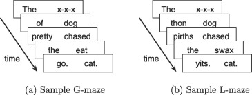

## The question

In the practical I set the following problem - note that it's marked as optional!

- [Optional] An alternative to self-paced reading is the Maze task (e.g. Forster et al., 2009; Boyce et al., 2020); like self-paced reading your participants work through a sentence word by word, but unlike in self-paced reading at each step they chose one of two continuations for the sentence (see image below from Boyce et al., 2020 - G-Maze refers to mazes where the distractors are English words which would be ungrammatical continuations, L-maze has non-word distractors). Can you convert the self-paced reading code to run as a maze task? For each word presentation you will need an alternative continuation, and some way of the participant selecting their continuation (e.g. keyboard? button?). Maze tasks also don't feature comprehension questions so you can drop those (the idea is that selecting the correct continuation throughout shows you are paying attention). Mazes also abort the sentence when the participant makes a mistake - we haven't covered this yet and it is tricky to implement, so I would suggest skipping this feature of the maze for now, but is possible using `on_finish` and `jsPsych.abortCurrentTimeline` (see explanation and example in [core jsPsych documentation](https://www.jspsych.org/v8/reference/jspsych/). If you decide to have a go at this task, you can then take a look at [my thoughts on how it could be done](oels_practical_wk5_maze.md).



How would you adapt the self-paced reading code we gave you to do this? The first most obvious problem is that the self-paced reading code presents a single word on-screen at each reading trial, but here you want 2 - the correct continuation and the distractor (I'll use non-word distractors, so I'll give you code for an L-maze, but changing it to a G-maze just involves plugging in different distractors). So we need a way to get two options up on screen somehow and have the participant select one. 

There are a couple of ways (at least!) we could do this, I'll show you two simple ones below. Note that we really want show those two options on screen in random order, rather than e.g. always the correct option on the left (which participants would quickly notice!), so I'll implement that but in a very simple way - soon you'll see more sophisticated ways of automatically randomising parts of trials. 

In terms of how participants give their responses, we could get them to click on buttons (so the two possible continuations are the two buttons they see), or we could show the two words on the left and right and get a key-press to indicate which continuation the participant wants (e.g. z key to indicate the left continuation, m key for the right, since those are keys on the left and right of a QWERTY keyboard respectively). Keyboard responses are more like the main self-paced reading code so I'll start there.

Finally, following my suggestion, I am going to skip the code for aborting a trial when the participant gives an incorrect response - but later in the course you'll see how to do contingent trials where what a participant selects on one trial influences what they see next, which would be a crucial ingredient of the trial-aborting process.

## Option 1: keyboard response

One  way to show the two options side-by-side in a simple text `stimulus`, then get the participant to response with a key-press indicating which is the correct continuation.

```js
var maze_trial_1 = {
  type: jsPsychHtmlKeyboardResponse,
  choices: ["z","m"], 
  prompt: "<em>Press z for the left choice, m for the right choice",
  timeline: [
    { stimulus: "The x-x-x" },
    { stimulus: "dog thon" },
    { stimulus: "pirths chased" },
    { stimulus: "swax the" },
    { stimulus: "cat. yits." },
  ]
};
```

This is very similar to the main self-paced reading code, except that we have two response `choices` and the `stimulus` contains the two continuations separated by a space. 

You can download all the code for this implementation through the following two links:
- <a href="code/maze/maze_keyboard.html" download> Download maze_keypress.html</a>
- <a href="code/maze/maze_keyboard.js" download> Download maze_keypress.js</a>


# Option 2: button response

The other obvious way to get responses is through button-press, in which case it makes sense to put the possible continuations on the buttons. jsPsych will complain if we don't have a `stimulus`, so we'll put the instruction in the stimulus rather than the prompt. Another option would be a blank stimulus and the instruction in the prompt. 

```js
var maze_trial_1 = {
  type: jsPsychHtmlButtonResponse,
  stimulus: "<em>Select a continuation</em>",
  timeline: [
    { choices: ["The", "x-x-x"] },
    { choices: ["dog", "thon"] },
    { choices: ["pirths", "chased"] },
    { choices: ["swax", "the"] },
    { choices: ["cat.", "yits."] },
  ]
};
```

You can download all the code for this implementation through the following two links:
- <a href="code/maze/maze_button.html" download> Download maze_button.html</a>
- <a href="code/maze/maze_button.js" download> Download maze_button.js</a>

## References

[Boyce, V., Futrell, R., & Levy, R. P. (2020). Maze Made Easy: Better and easier measurement of incremental processing difficulty. *Journal of Memory and Language, 111,* 104082.](https://doi.org/10.1016/j.jml.2019.104082)

[Forster, K. I., Guerrera, C., & Elliot, L. (2009). The maze task: Measuring forced incremental sentence processing time.
*Behavior Research Methods, 41,* 163-171.](https://doi.org/10.3758/BRM.41.1.163)

## Re-use

All aspects of this work are licensed under a [Creative Commons Attribution 4.0 International License](http://creativecommons.org/licenses/by/4.0/).
